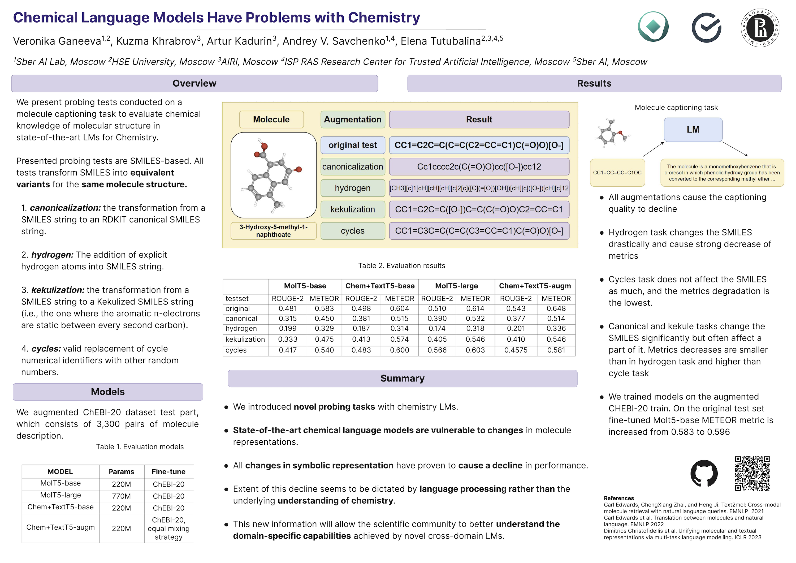

# SMILES-probing

_Repository of "Chemical Language Models Have Problems with Chemistry: A Case Study on Molecule Captioning Task"_

## Augmentations

'./code/augmentation.py' creates 4 types of augmentations: 
- rdkit canonicalization
- explicit addition of hydrogens
- kekulization
- replacement of cycle identifiers by random numbers

Full description is provided in the paper.

## Experimental dataset

Experimental dataset is provided in the folder "data" and was created by "augmentation" code. Original (non-augmented) sample of dataset is a test part of CHEBI-20.

## Model evaluation

There are 4 models used in the experiment:
  - 'laituan245/molt5-base-smiles2caption'
  - 'laituan245/molt5-large-smiles2caption'
  - 'GT4SD/multitask-text-and-chemistry-t5-base-standard'
  - 'GT4SD/multitask-text-and-chemistry-t5-base-augm'
  
Code for model inference is located in the "code" folder.

